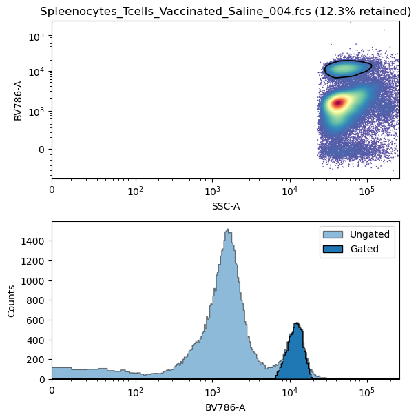

# Using AutoGator


## Quickstart

### Creating initial object
```python
example_gator = AutoGator(
    gate_fraction= 0.85, # How aggresive the 'positive' gate should be
    negative_gate_fraction= 0.999, # How aggressive the 'negative' (subtractive) gate should be
    control_sample= control_location, # Location of the control sample
    second_dimension= 'SSC-A' # Second axis to use for gating
)
```

### Adding FMOs
(note:  I couldn't actually find good example data with multiple example FMOs which were god candidates for this method.  This wasn't actually run with a 'CD3' or 'CD8' FMO,just showing as example)

```python
example_gator.add_fmo(
    name = 'CD3', # Name of the target for the omitted fluorescent dye
    location = cd3_fmo_location,
)

example_gator.add_fmo(
    name = 'CD4', 
    location = cd4_fmo_location
)

example_gator.add_fmo(
    name = 'CD8', 
    location = cd8_fmo_location
)
```

### Gating Unknown Sample
```python
imort FlowCal

unknown_sample= FlowCal.io.FCSData(unknown_location) # We first need a FlowCal object of the sample to gate

unknown_mask = example_gator.gate(
    unknown_sample, # Location of the sample to be gated
    'CD4', # Name of the gate
    plot = False # Whether or not visualize the plot, (adds a couple seconds to execution time, and only works in Jupyter Kernel)
)
```

**Output**:

This returns only a numpy mask for the dataset.  This is the most performant option if you only need to know the percentage of events which falls into the gate

```python
print(np.mean(control_mask))
# Output: 0.12295572856682176
```

### Plotting Unknown Sample:
```python
unknown_mask = example_gator.gate(
    unknown,
    'CD4',
    plot = True
)
```
**Output**:



### Alternate: Adding FMOs upon creation of initial object
You can add FMOs upon initialization by passing in a list of kwarg dictionaries

```python
fmo_list = [
    {
        "name":"CD3",
        "location": cd3_fmo_location
    },
    {
        "name":"CD4",
        "location": cd4_fmo_location
    },
    {
        "name":"CD8",
        "location": cd8_fmo_location
    }

example_gator = AutoGator(
    gate_fraction= 0.85,
    negative_gate_fraction= 0.999,
    control_sample= control_location,
    fmos= fmo_list,
    second_dimension= 'SSC-A'
)
```

### Getting Gate Boundary:
the 'gate()' method only returns an array mask.  If you want the set of polygons actually drawing the gate you can use the 'get_gate_boundary() method'

This returns a dictionary with the following structure:
```python 
{
            'channels': [], # A list the channel used for this gate,
            'contour': [np.array, ...] # A list of numpy arrays each corresponding to a polygon gate, with shape (n,2).  (With proper parameter tuning, this should ideally have a length of 1)
}
```

Example:
```python
cd4_boundry = spleen_gator.get_gate_boundry(
    target= 'CD4'
)

print(cd4_boundry['channels'])
cd4_boundry['contour'][0].shape
# Output:
# ['SSC-A', 'BV786-A']
# (500, 2)
```

## Untested functionality: Creating a control sample if one is not given

##### **Note:** I have written in the ability to create a control sample if one is not given but multiple FMOs are.  It does this by amalgamating all FMOs into a single sample. In theory this should work, but I did not find a good example dataset to test this on, so in attition to debugging the concept the code itself may contain some initial errors that I can't have seen without proper testing

This is achieved with the following:

```python
example_gator = AutoGator(
    gate_fraction= 0.85,
    negative_gate_fraction= 0.999,
    second_dimension= 'SSC-A'
)

example_gator.add_fmo(
    name = 'CD3', # Name of the target for the omitted fluorescent dye
    location = cd3_fmo_location,
    recalculate_controls = False # Set this to False until the last FMO is added
)

example_gator.add_fmo(
    name = 'CD4', 
    location = cd4_fmo_location,
    recalculate_controls = False
)

example_gator.add_fmo(
    name = 'CD8', 
    location = cd8_fmo_location,
    recalculate_controls = True
)
```

This should happen automatically if adding multiple FMOs without adding a control sample
